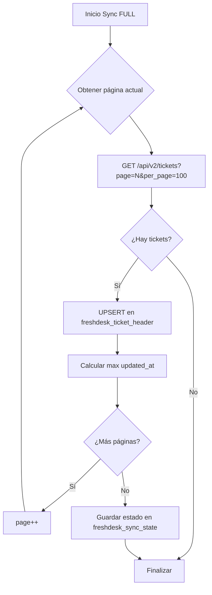
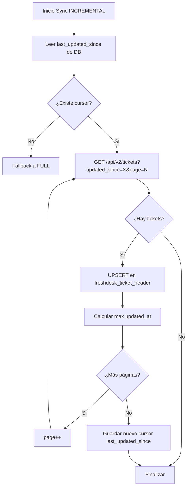

# 🎫 Freshdesk Ticket Header Sync - Implementación Completa

## 📋 Resumen

Sistema de sincronización de cabeceras de tickets de Freshdesk (sin conversaciones) con soporte para modo **FULL** (completo) e **INCREMENTAL** (desde última fecha).

---

## 🗄️ Base de Datos

### Tablas Creadas

#### 1. `freshdesk_ticket_header`
Almacena las cabeceras de tickets sincronizados desde Freshdesk.

```sql
CREATE TABLE pss_dvnx.freshdesk_ticket_header (
    ticket_id BIGINT PRIMARY KEY,
    subject VARCHAR(500),
    status INT NOT NULL,
    priority INT NOT NULL,
    type VARCHAR(50),
    requester_id BIGINT,
    responder_id BIGINT,
    group_id BIGINT,
    company_id BIGINT,
    created_at TIMESTAMP WITH TIME ZONE NOT NULL,
    updated_at TIMESTAMP WITH TIME ZONE NOT NULL,
    tags TEXT[],
    custom_fields JSONB,
    synced_at TIMESTAMP WITH TIME ZONE NOT NULL DEFAULT NOW()
);
```

**Índices:**
- `ix_freshdesk_ticket_header_updated_at` - Para sincronización incremental
- `ix_freshdesk_ticket_header_status` - Para filtros por estado
- `ix_freshdesk_ticket_header_responder` - Para filtros por técnico
- `ix_freshdesk_ticket_header_company` - Para filtros por empresa
- `ix_freshdesk_ticket_header_tags` - Índice GIN para búsqueda en tags

#### 2. `freshdesk_sync_state`
Guarda el estado de las sincronizaciones por scope.

```sql
CREATE TABLE pss_dvnx.freshdesk_sync_state (
    scope VARCHAR(50) PRIMARY KEY,
    last_sync_at TIMESTAMP WITH TIME ZONE NOT NULL,
    last_result_count INT NOT NULL DEFAULT 0,
    last_max_updated_at TIMESTAMP WITH TIME ZONE,
    last_updated_since TIMESTAMP WITH TIME ZONE,
    last_error TEXT,
    metadata JSONB
);
```

**Scope usado:** `ticket_headers`

---

## 🔧 Configuración

### 1. FreshdeskOptions (appsettings.json)

```json
{
  "Freshdesk": {
    "Domain": "alterasoftware",
    "ApiKey": "9i1AtT08nkY1B1BmjtLk",
    "SyncIntervalHours": 24,
    "SyncEnabled": true,
    "PerPage": 100
  }
}
```

**Variables de entorno (producción):**
```bash
FRESHDESK__DOMAIN=alterasoftware
FRESHDESK__APIKEY=9i1AtT08nkY1B1BmjtLk
FRESHDESK__SYNCENABLED=true
FRESHDESK__SYNCINTERVALHOURS=24
FRESHDESK__PERPAGE=100
```

### 2. User Secrets (desarrollo local)

```bash
dotnet user-secrets set "Freshdesk:ApiKey" "9i1AtT08nkY1B1BmjtLk"
dotnet user-secrets set "Freshdesk:Domain" "alterasoftware"
dotnet user-secrets set "Freshdesk:SyncEnabled" "true"
dotnet user-secrets set "Freshdesk:PerPage" "100"
```

---

## 🏗️ Arquitectura

### Componentes

1. **FreshdeskClient** - Cliente HTTP para Freshdesk API
   - `GetTicketsPageAsync(page, perPage)` - Obtiene tickets por página
   - `GetTicketsUpdatedSinceAsync(updatedSince, page, perPage)` - Tickets desde fecha

2. **FreshdeskTicketHeaderSyncService** - Lógica de sincronización
   - `SyncAsync(bool full)` - Ejecuta sincronización full o incremental
   - `GetStatusAsync()` - Obtiene estado de última sincronización

3. **FreshdeskController** - Endpoints HTTP
   - `POST /api/v1/integrations/freshdesk/sync/ticket-headers?full=true`
   - `GET /api/v1/integrations/freshdesk/sync/status`

---

## 🔄 Flujo de Sincronización

### Modo FULL (completo)



### Modo INCREMENTAL (desde última fecha)



---

## 🚀 Uso

### 1. Crear las tablas (primera vez)

```bash
psql -h localhost -p 5434 -U postgres -d pss_dvnx -f scripts/create-freshdesk-ticket-header-tables.sql
```

### 2. Ejecutar sincronización manual

#### Full (todos los tickets)
```bash
POST /api/v1/integrations/freshdesk/sync/ticket-headers?full=true
Authorization: Bearer {token}
```

#### Incremental (desde última sincronización)
```bash
POST /api/v1/integrations/freshdesk/sync/ticket-headers?full=false
Authorization: Bearer {token}
```

### 3. Verificar estado

```bash
GET /api/v1/integrations/freshdesk/sync/status
Authorization: Bearer {token}
```

**Respuesta ejemplo:**
```json
{
  "success": true,
  "state": {
    "scope": "ticket_headers",
    "lastSyncAt": "2025-01-30T10:30:00Z",
    "lastResultCount": 150,
    "lastMaxUpdatedAt": "2025-01-30T10:25:00Z",
    "lastUpdatedSince": "2025-01-30T10:25:00Z",
    "lastError": null,
    "metadata": "{\"mode\":\"incremental\",\"ticketsScanned\":150,\"durationMs\":5432}"
  }
}
```

---

## 🧪 Testing

### Script de PowerShell

```powershell
# Modo incremental
.\scripts\test-freshdesk-sync.ps1 -Mode incremental

# Modo full
.\scripts\test-freshdesk-sync.ps1 -Mode full
```

### Swagger UI

1. Login Desktop: `POST /api/v1/auth/login-desktop`
2. Copiar `accessToken`
3. Autorizar en Swagger (botón 🔓)
4. Ejecutar sincronización: `POST /api/v1/integrations/freshdesk/sync/ticket-headers?full=true`
5. Ver estado: `GET /api/v1/integrations/freshdesk/sync/status`

---

## 📊 Logs

El sistema genera logs detallados:

```
🔄 Iniciando sincronización de ticket headers (modo: incremental)
   📅 Sincronización incremental desde: 2025-01-30T10:00:00Z
   📄 Página 1: 100 tickets procesados (100 upserted, total: 100)
   📄 Página 2: 50 tickets procesados (50 upserted, total: 150)
   ✅ No hay más tickets. Terminando sincronización.
✅ Sincronización completada exitosamente
   📊 Tickets escaneados: 150
   💾 Tickets upserted: 150
   📅 Max updated_at: 2025-01-30T10:25:00Z
   ⏱️ Duración: 5432ms
```

---

## 🔐 Seguridad

- ✅ Solo usuarios con rol **ADMIN** pueden ejecutar sincronizaciones
- ✅ Todos los endpoints requieren autenticación (excepto `ping`)
- ✅ API Key de Freshdesk almacenada en User Secrets (local) o variables de entorno (producción)
- ✅ Conexiones HTTPS a Freshdesk
- ✅ BasicAuth con API Key para Freshdesk

---

## ⚠️ Consideraciones

### Rate Limiting
- Freshdesk tiene límites de rate (1000 requests/hora en plan básico)
- El servicio implementa delay de 500ms entre páginas
- En caso de rate limit, se lanza excepción `InvalidOperationException`

### UPSERT
- Se usa `ON CONFLICT (ticket_id) DO UPDATE` para evitar duplicados
- Los tickets existentes se actualizan con la información más reciente
- `synced_at` siempre se actualiza a NOW()

### Paginación
- Freshdesk devuelve máximo 100 tickets por página (configurado en `PerPage`)
- El servicio recorre automáticamente todas las páginas hasta que no hay más resultados
- Se para cuando recibe menos tickets que `PerPage`

---

## 📁 Archivos Creados

```
scripts/
  └── create-freshdesk-ticket-header-tables.sql    # SQL para crear tablas
  └── test-freshdesk-sync.ps1                     # Script de prueba PowerShell

GestionTime.Infrastructure/Services/Freshdesk/
  ├── FreshdeskOptions.cs                          # Actualizado con PerPage
  ├── FreshdeskClient.cs                           # Métodos GetTicketsPageAsync y GetTicketsUpdatedSinceAsync
  └── FreshdeskTicketHeaderSyncService.cs          # ✨ NUEVO servicio de sincronización

Controllers/
  └── FreshdeskController.cs                       # Endpoints de sincronización

Program.cs                                          # Registro de FreshdeskTicketHeaderSyncService en DI
```

---

## ✅ Checklist de Implementación

- [x] Crear tablas `freshdesk_ticket_header` y `freshdesk_sync_state`
- [x] Actualizar `FreshdeskOptions` con `PerPage`
- [x] Agregar métodos `GetTicketsPageAsync` y `GetTicketsUpdatedSinceAsync` a `FreshdeskClient`
- [x] Crear `FreshdeskTicketHeaderSyncService` con lógica de sincronización
- [x] Registrar servicio en `Program.cs`
- [x] Agregar endpoints `POST /sync/ticket-headers` y `GET /sync/status`
- [x] Crear script de prueba PowerShell
- [x] Documentar todo en README

---

## 🎯 Próximos Pasos (Opcional)

1. **Sincronización automática** - Crear un `BackgroundService` similar a `FreshdeskSyncBackgroundService`
2. **Webhooks** - Recibir notificaciones push de Freshdesk cuando hay cambios
3. **Consultas optimizadas** - Endpoints para buscar/filtrar tickets localmente
4. **Dashboard** - Vista de estadísticas de tickets sincronizados
5. **Sincronización de conversaciones** - Expandir para incluir comentarios

---

## 📞 Soporte

Para problemas o preguntas:
1. Revisar logs de la aplicación
2. Verificar estado con `GET /api/v1/integrations/freshdesk/sync/status`
3. Consultar documentación de Freshdesk API: https://developers.freshdesk.com/api/

---

**Implementado por:** GitHub Copilot  
**Fecha:** 30 de Enero de 2025  
**Versión:** 1.0
